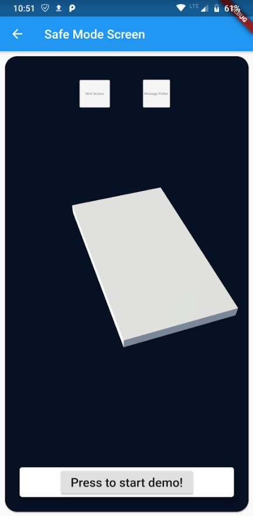

# WMM
Wrist Motion Monitor, senior design project for Mississippi State University

When making commits, pulling, or pushing changes, either use the git command line (https://git-scm.com/download/win) or github desktop (https://desktop.github.com/) 
This removes the file size limit when adding files in browser! 

guide for using git command line (https://www.youtube.com/watch?v=SWYqp7iY_Tc) 

guide for using github desktop (https://www.youtube.com/watch?v=77W2JSL7-r8) 

# Flutter/Unity/Bluetooth demo setup (currently only usable on android) 

1. Clone the repository (either download the .zip file from github or clone using github desktop/git command line) 
2. Load WMM-master\arduino\BLE\BLE_server_multiconnect onto ESP32 
3. Open WMM-master\app\flutter-unity-view-widget-master\example on android studio
4. Run flutter pub get on android studio terminal (should get a pop up when you first open the project on android studio asking to install dependecies, this works as well) 
5. Compile the project onto your phone, should get a screen that looks like this

6. Select Bluetooth Setup
7. Tap on the search icon in bottom right corner

8. Connect to the ESP32

9. Tap the edit symbol adjacent to MTU size option, should change it from 20 bytes to 223 bytes
10. Tap the button with the raised hand, this should open the unity project 

11. Press the "Press to start demo!" button at the bottom of the screen 
12. Should be working! 
